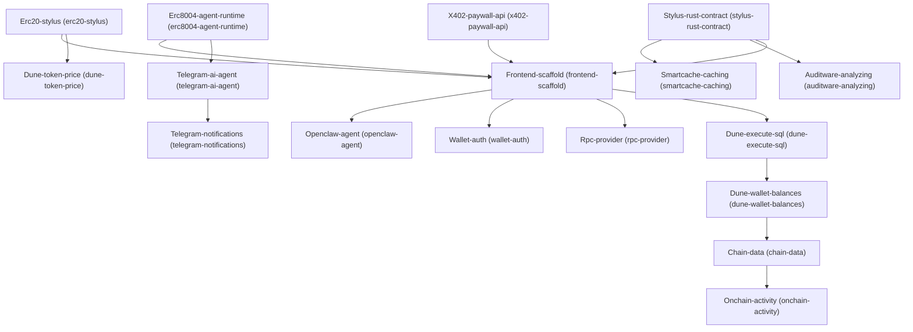

# Architecture

## Dependency Graph

## Execution / Implementation Order

1. **X402-paywall-api** (`547a1cc1`)
2. **Erc20-stylus** (`6c2cb45c`)
3. **Erc8004-agent-runtime** (`f8aff560`)
4. **Stylus-rust-contract** (`cc3f6c67`)
5. **Dune-token-price** (`c5a35edb`)
6. **Telegram-ai-agent** (`d4498e91`)
7. **Smartcache-caching** (`61fc8bca`)
8. **Auditware-analyzing** (`0d190c4d`)
9. **Frontend-scaffold** (`fcba6a97`)
10. **Telegram-notifications** (`d998f672`)
11. **Openclaw-agent** (`e708b325`)
12. **Wallet-auth** (`757e8495`)
13. **Rpc-provider** (`225b1cc5`)
14. **Dune-execute-sql** (`1201447a`)
15. **Dune-wallet-balances** (`93f7a827`)
16. **Chain-data** (`5839eb01`)
17. **Onchain-activity** (`a0b24be1`)
