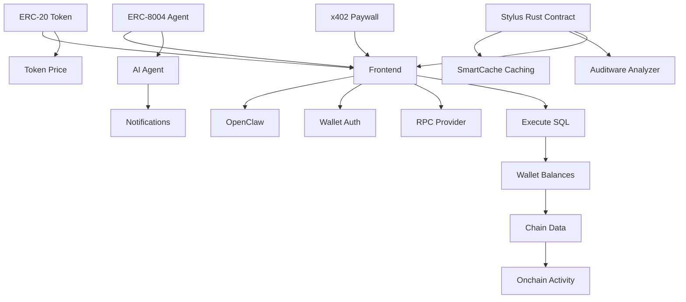

# My App

> A Web3 application composed with [N]skills.

**Network**: Arbitrum Sepolia (Chain ID: 421614) — Testnet
**Keywords**: 

---

## Architecture

## Components

| Component | Type | Category | User Prompt |
|-----------|------|----------|-------------|
| x402 Paywall | `x402-paywall-api` | payments | (none) |
| ERC-20 Token | `erc20-stylus` | contracts | (none) |
| ERC-8004 Agent | `erc8004-agent-runtime` | agents | (none) |
| Stylus Rust Contract | `stylus-rust-contract` | contracts | (none) |
| Token Price | `dune-token-price` | analytics | (none) |
| AI Agent | `telegram-ai-agent` | telegram | (none) |
| SmartCache Caching | `smartcache-caching` | contracts | (none) |
| Auditware Analyzer | `auditware-analyzing` | contracts | (none) |
| Frontend | `frontend-scaffold` | app | (none) |
| Notifications | `telegram-notifications` | telegram | (none) |
| OpenClaw | `openclaw-agent` | agents | (none) |
| Wallet Auth | `wallet-auth` | app | (none) |
| RPC Provider | `rpc-provider` | app | (none) |
| Execute SQL | `dune-execute-sql` | analytics | (none) |
| Wallet Balances | `dune-wallet-balances` | analytics | (none) |
| Chain Data | `chain-data` | app | (none) |
| Onchain Activity | `onchain-activity` | agents | (none) |

## Implementation Order

Build the project in this order (respects dependencies):

1. **x402 Paywall** (`x402-paywall-api`) — see `.nskills/components/x402-paywall-api--547a1cc1.md`
2. **ERC-20 Token** (`erc20-stylus`) — see `.nskills/components/erc20-stylus--6c2cb45c.md`
3. **ERC-8004 Agent** (`erc8004-agent-runtime`) — see `.nskills/components/erc8004-agent-runtime--f8aff560.md`
4. **Stylus Rust Contract** (`stylus-rust-contract`) — see `.nskills/components/stylus-rust-contract--cc3f6c67.md`
5. **Token Price** (`dune-token-price`) — see `.nskills/components/dune-token-price--c5a35edb.md`
6. **AI Agent** (`telegram-ai-agent`) — see `.nskills/components/telegram-ai-agent--d4498e91.md`
7. **SmartCache Caching** (`smartcache-caching`) — see `.nskills/components/smartcache-caching--61fc8bca.md`
8. **Auditware Analyzer** (`auditware-analyzing`) — see `.nskills/components/auditware-analyzing--0d190c4d.md`
9. **Frontend** (`frontend-scaffold`) — see `.nskills/components/frontend-scaffold--fcba6a97.md`
10. **Notifications** (`telegram-notifications`) — see `.nskills/components/telegram-notifications--d998f672.md`
11. **OpenClaw** (`openclaw-agent`) — see `.nskills/components/openclaw-agent--e708b325.md`
12. **Wallet Auth** (`wallet-auth`) — see `.nskills/components/wallet-auth--757e8495.md`
13. **RPC Provider** (`rpc-provider`) — see `.nskills/components/rpc-provider--225b1cc5.md`
14. **Execute SQL** (`dune-execute-sql`) — see `.nskills/components/dune-execute-sql--1201447a.md`
15. **Wallet Balances** (`dune-wallet-balances`) — see `.nskills/components/dune-wallet-balances--93f7a827.md`
16. **Chain Data** (`chain-data`) — see `.nskills/components/chain-data--5839eb01.md`
17. **Onchain Activity** (`onchain-activity`) — see `.nskills/components/onchain-activity--a0b24be1.md`

## Environment Variables

| Key | Description | Required | Default |
|-----|-------------|----------|---------|
| `PAYMENT_RECEIVER_ADDRESS` | Ethereum address to receive payments | Yes |  |
| `PAYMENT_PRIVATE_KEY` | Private key for signing receipts | Yes |  |
| `NEXT_PUBLIC_TOKEN_ADDRESS` | Deployed ERC20 token address | No |  |
| `PRIVATE_KEY` | Private key for deployment and transactions | Yes |  |
| `ERC20_DEPLOYMENT_API_URL` | URL of the ERC20 deployment API | No | http://localhost:4000 |
| `AGENT_NAME` | Name of the AI agent | Yes | MyAgent |
| `OPENROUTER_API_KEY` | OpenRouter API key for LLM access | Yes |  |
| `OPENROUTER_MODEL` | Model to use via OpenRouter | No | openai/gpt-4o |
| `NEXT_PUBLIC_AGENT_REGISTRY_ADDRESS` | ERC-8004 registry contract address | No |  |
| `AGENT_PRIVATE_KEY` | Agent wallet private key for registry operations | No |  |
| `NEXT_PUBLIC_AGENT_NETWORK` | Network for agent operations (arbitrum or arbitrum-sepolia) | Yes | arbitrum |
| `STYLUS_RPC_URL` | Arbitrum RPC URL for deployment | Yes | https://sepolia-rollup.arbitrum.io/rpc |
| `DEPLOYER_PRIVATE_KEY` | Private key for deployment | Yes |  |
| `DUNE_API_KEY` | Dune Analytics API key for blockchain data queries | Yes |  |
| `TELEGRAM_BOT_TOKEN` | Bot token from @BotFather | Yes |  |
| `OPENAI_API_KEY` | API key for OpenAI | Yes |  |
| `NEXT_PUBLIC_WALLETCONNECT_PROJECT_ID` | WalletConnect Cloud project ID for wallet connections | Yes |  |
| `NEXT_PUBLIC_APP_NAME` | Application name displayed in wallet dialogs | No | My DApp |
| `NEXT_PUBLIC_ALCHEMY_API_KEY` | Alchemy API key for RPC access | Yes |  |
| `ALCHEMY_API_KEY` | Alchemy API key for fetching onchain activity | Yes |  |
| `NEXT_PUBLIC_ONCHAIN_NETWORK` | Network for onchain activity (arbitrum or arbitrum-sepolia) | Yes | arbitrum |

## Key Dependencies

| Package | Version |
|---------|---------|
| `next` | `^14.2.0` |
| `react` | `^18.3.0` |
| `react-dom` | `^18.3.0` |
| `wagmi` | `^2.12.0` |
| `viem` | `^2.21.0` |
| `@tanstack/react-query` | `^5.51.0` |
| `@rainbow-me/rainbowkit` | `^2.1.0` |
| `clsx` | `^2.1.0` |
| `tailwind-merge` | `^2.2.0` |
| `ethers` | `^6.13.0` |
| `lucide-react` | `^0.400.0` |
| `@radix-ui/react-select` | `^2.0.0` |
| `@types/node` | `^20.0.0` |
| `@types/react` | `^18.3.0` |
| `@types/react-dom` | `^18.3.0` |
| `typescript` | `^5.4.0` |
| `eslint` | `^8.57.0` |
| `eslint-config-next` | `^14.2.0` |
| `tailwindcss` | `^3.4.0` |
| `postcss` | `^8.4.0` |
| `autoprefixer` | `^10.4.0` |

## Detailed Component Specs

- [x402 Paywall](.nskills/components/x402-paywall-api--547a1cc1.md)
- [ERC-20 Token](.nskills/components/erc20-stylus--6c2cb45c.md)
- [ERC-8004 Agent](.nskills/components/erc8004-agent-runtime--f8aff560.md)
- [Stylus Rust Contract](.nskills/components/stylus-rust-contract--cc3f6c67.md)
- [Token Price](.nskills/components/dune-token-price--c5a35edb.md)
- [AI Agent](.nskills/components/telegram-ai-agent--d4498e91.md)
- [SmartCache Caching](.nskills/components/smartcache-caching--61fc8bca.md)
- [Auditware Analyzer](.nskills/components/auditware-analyzing--0d190c4d.md)
- [Frontend](.nskills/components/frontend-scaffold--fcba6a97.md)
- [Notifications](.nskills/components/telegram-notifications--d998f672.md)
- [OpenClaw](.nskills/components/openclaw-agent--e708b325.md)
- [Wallet Auth](.nskills/components/wallet-auth--757e8495.md)
- [RPC Provider](.nskills/components/rpc-provider--225b1cc5.md)
- [Execute SQL](.nskills/components/dune-execute-sql--1201447a.md)
- [Wallet Balances](.nskills/components/dune-wallet-balances--93f7a827.md)
- [Chain Data](.nskills/components/chain-data--5839eb01.md)
- [Onchain Activity](.nskills/components/onchain-activity--a0b24be1.md)

## Additional Context

- [Project Configuration](.nskills/project.md)
- [Full Architecture Details](.nskills/architecture.md)
- [All Environment Variables](.nskills/environment.md)
- [Verified Dependencies](.nskills/dependencies.md)
- [Scripts Reference](.nskills/scripts.md)
- [Integration Map](.nskills/integration-map.md)

---

*Generated by [[N]skills](https://www.nskills.xyz) — Compose N skills for your Web3 project.*
